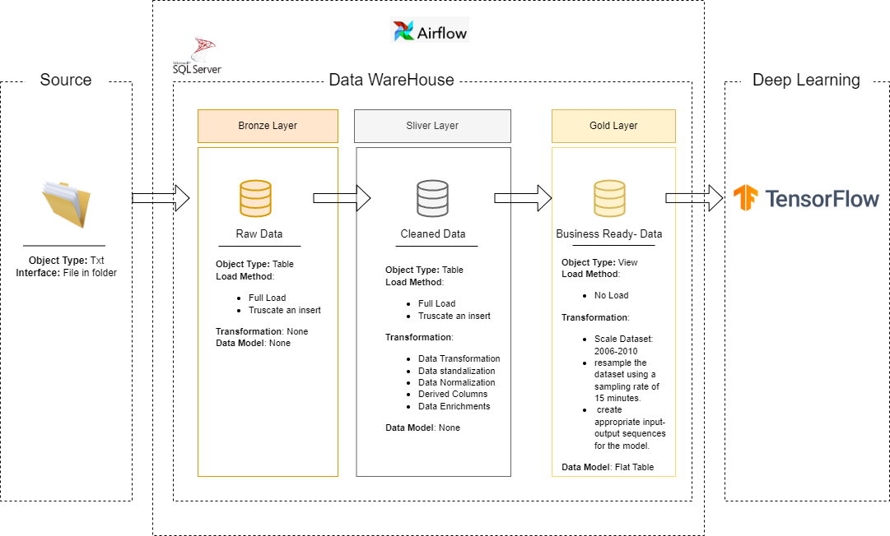

# Electricity-Demand-Forecasting-with-Deep-Learning
This repository consolidates household electric power consumption data into a **SQL Server data warehouse and trains a deep learning model (e.g.,) to forecast electricity demand for the next 1 hour**. The pipeline includes data preprocessing, model training, evaluation (using MSE, RMSE), and orchestration via Apache Airflow. Focused on Individual Household electricity consumption data from 2006–2010, resampled at 15-minute intervals, this project supports grid optimization through accurate demand forecasting using deep learning. Clear documentation is provided for stakeholders.

---
## 🏗️ Data Architecture
The data architecture for this project follows Medallion Architecture **Bronze**, **Silver**, and **Gold** layers:

1. **Bronze Layer**: Stores original raw data from the source text file. Data is ingested from txt Files into SQL Server Database.
2. **Silver Layer**: This layer includes data cleansing, standardization, and normalization processes to prepare deep learning.
3. **Gold Layer**: Houses model ready data modeled into a 2D tensor (Table).

---
## 📖 Project Overview

This project involves:

1. **Data Architecture**: Designing a Modern Data Warehouse Using Medallion Architecture **Bronze**, **Silver**, and **Gold** layers.
2. **ETL Pipelines**: Extracting, transforming, and loading data from source txt file into the Microsoft SQL warehouse.
3. **Data Modeling**: Developing 2d Tensor(table) optimized for Deep learning.
